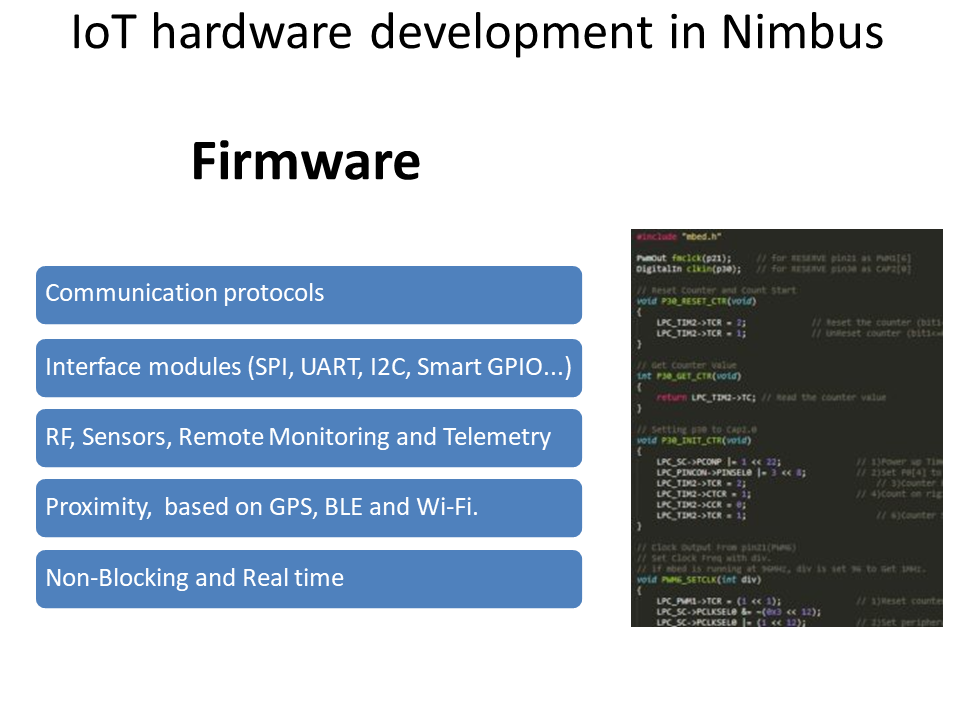
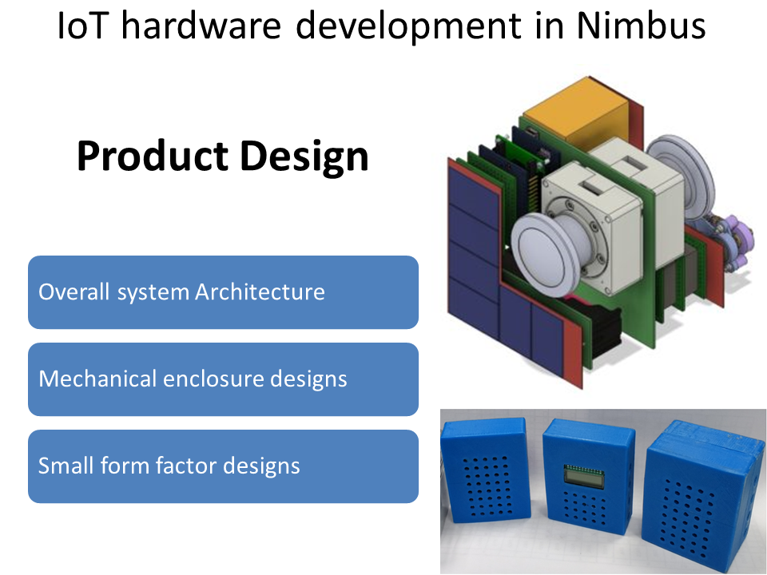
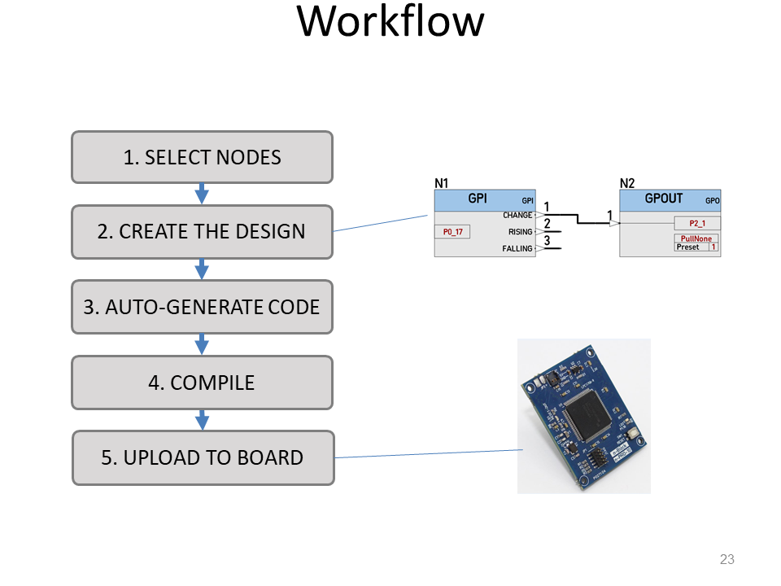

#  

# [iot-aec-nblockslecture](https://github.com/nikoschalikias/iot-aec-nblockslecture)

## lecture  setup notes    
          
* [go to CIT](https://www.cit.ie)
  *  login with old cit user name and current pasword
* [Staff Portal](https://workvivo.cit.ie/)
* [Login to canvas](https://cit.instructure.com/)
* Click on the panel for IT in AEC Industry 4.0
* Go to Week 5 - IOT - NIMBUS
* [On the left panel click on the zoom link](https://cit.instructure.com/courses/62261/external_tools/325)
* Click on the start button. Check that your zoom works.
* See email I sent out today at Tue 19/10/2021 10:07 subject [ALL]: Access to 29311( IT in AEC 4.0) and INTR9021 please and follow instructions.

## Brian suggestions
* How we develop
* Effort to develop
* Example projects
* Considerations for development

## Contents
* IoT Hardware development in Nimbus
* n-Blocks Hardware Platform
  * Motivation
  * Concepts
  * Modularity
  * Some use cases
* nBlocksStudio Firmware Development Platform
  * Concepts
  * Workflow
  * Examples
* Summary

## nBlocks Presentations to re-use

> In .gitignore, since they are large and some might contain protected IP

* 25-Jan-21  02:38 PM        27,448,586 1.biot_nblocks_nblocksStudio.pptx
* 19-Oct-21  02:04 PM        29,844,514 2.it_cork-NBLOCKS-14-09-2020.pptx
* 21-Jan-20  12:28 PM         4,523,602 4.Hardware-beyondiot.pptx
* 14-Jul-21  02:43 PM        54,997,324 5.ewC_2021_v4.pptx
* 30-Nov-20  04:03 PM        43,051,029 6.merged.pptx
* 16-Jan-20  05:17 PM        20,252,851 7.nBlocks-use-cases.pptx
* 28-Feb-20  02:35 PM        55,936,323 EWC_n-Blocks_presentation_final_02.pptx
* 20-Feb-18  12:11 PM        60,662,702 N-LoRaWAN.pptx
* 19-Sep-18  11:23 AM        11,585,384 project_Aquarius.pptx

## Slideck

----

-----

-----

-----

-----

-----

-----

-----

-----

-----

-----

-----

-----

-----

-----

-----

-----

-----

-----

-----

-----

-----

-----

-----

-----

-----

-----

-----

-----

-----

-----

-----

-----

